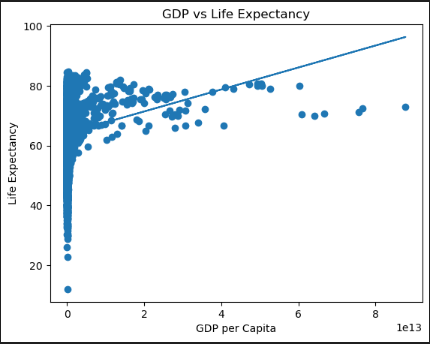
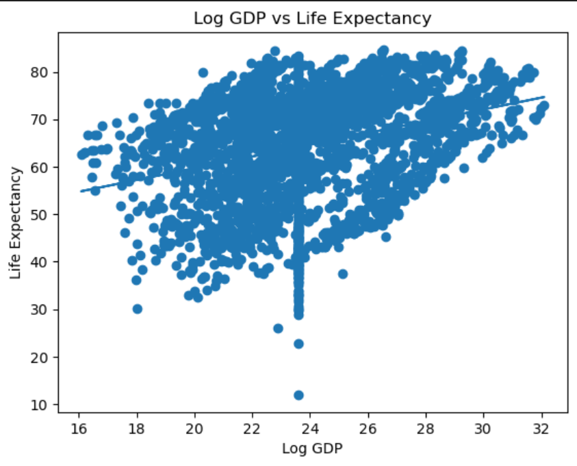
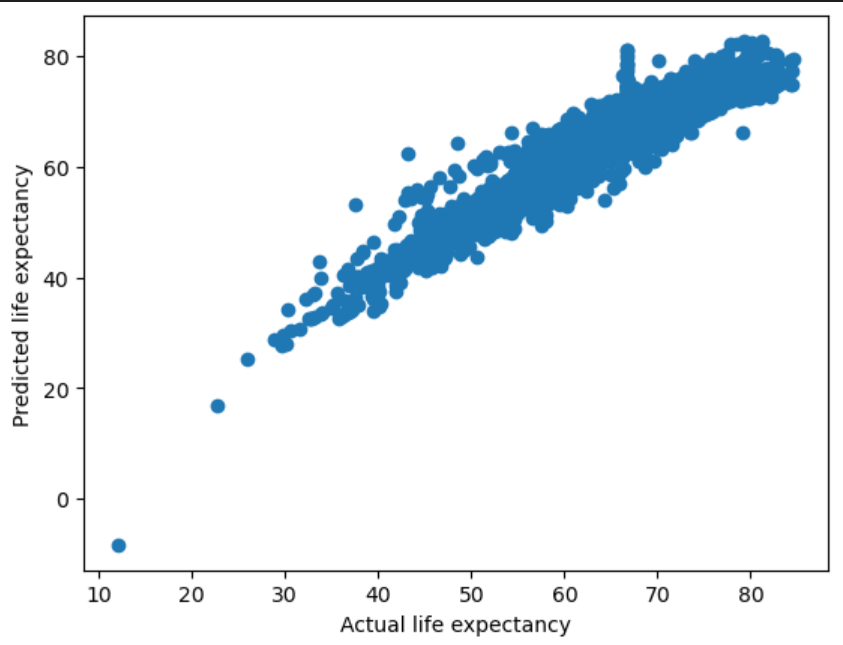

# ML Life Expectancy Prediction Project

This project uses Machine Learning (Linear Regression) to predict life expectancy
using World Bank Development Indicators dataset.

## Features
- Data Cleaning
- Feature Selection
- Linear Regression Model
- Model Evaluation (R2 Score, MSE)
- Data Visualization

## Tools Used
- Python
- Pandas
- Numpy
- Matplotlib
- Scikit-learn

## Dataset
World Bank Development Indicators

## Author
Rinoy Jerome

## Output Graphs

### GDP vs Life Expectancy

### Log GDP vs Life Expectancy

### Prediction Result

